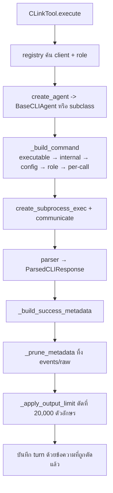

# Clink Overview and Integration

`clink` คือสิ่งที่ fork นี้เพิ่มเข้ามา และเป็นเหตุผลที่ fork นี้มีอยู่ · มันรับ prompt แล้ว **spawn coding agent ของค่ายอื่นเป็น subprocess** — codex, cursor, antigravity, claude, opencode

*เขียนเมื่อ 2026-08-13 ที่ `2aa6e49` · โครงสร้างที่อ้างถึงอยู่ใน [GENERATED_STRUCTURE.md](../GENERATED_STRUCTURE.md)*

## 1. โครงสามชิ้นที่แยกกันชัด

```text
conf/cli_clients/<name>.json   นิยาม client — คำสั่ง, args, role, model_catalog, rate_card
clink/constants.py             INTERNAL_DEFAULTS — parser, args ที่ต่อรองไม่ได้, timeout, runner
clink/agents/<name>.py         การสร้างคำสั่งและการรัน — ต่อเมื่อ client ต้องการพฤติกรรมพิเศษ
clink/parsers/<name>.py        แปลง stdout เป็น ParsedCLIResponse — ต่อรูปแบบ output
```

ชั้นนี้มี 22 โมดูล 2,407 บรรทัด ซึ่งเล็กที่สุดในบรรดาชั้นหลัก แต่แบกความเสี่ยงมากที่สุด

## 2. เส้นทางของ call หนึ่งครั้ง



**ลำดับของ args สำคัญ** — per-call มาท้ายสุดจึงชนะเสมอ (`clink/agents/base.py:506-521`)

## 3. จุดเสียบ — เพิ่ม client ใหม่

| ไฟล์ | จำเป็นไหม | ถ้าไม่มีเกิดอะไร |
|---|---|---|
| `clink/constants.py` `INTERNAL_DEFAULTS` | **จำเป็น และต้องทำก่อน** | `RegistryLoadError` และมันลาก registry ทั้งชุดลงไปด้วย |
| `conf/cli_clients/<name>.json` | **จำเป็น** | ไม่มีอะไรให้โหลด |
| `systemprompts/clink/*.txt` ของทุก role | **จำเป็น** (ใช้ของเดิมซ้ำได้) | `RegistryLoadError: Prompt file not found` |
| `clink/parsers/<name>.py` | ไม่จำเป็น | ใช้ parser เดิมได้ — `cursor` ใช้ `antigravity_text` |
| `clink/agents/<name>.py` | ไม่จำเป็น | ตกไปที่ `BaseCLIAgent` เงียบๆ |
| `clink/discovery.py` `_KNOWN_LOCATIONS` | ไม่จำเป็น | คำสั่งต้องอยู่บน `PATH` ของ PAL |

**สิ่งที่ได้ฟรีจากเส้นทางพื้นฐาน** (ทำแค่สองข้อแรก) — การประกอบคำสั่งตามลำดับ · การส่ง `--model` · การปฏิเสธจาก model catalog **ก่อน** spawn process · การหา executable พร้อมข้อความบอกเมื่อไม่เจอ · การรวม environment · และ parser ที่ระบุไว้ · **สิ่งที่ไม่ได้คือ token usage กับ cost** — `USAGE_FIELD_MAP` ของฐานว่างเปล่าโดยตั้งใจ เพื่อให้ adapter ที่ยังไม่เขียนรายงานว่าไม่มี แทนที่จะรายงานเลขผิด

## 4. กับดัก

**ดรอปไฟล์ JSON ลง `conf/cli_clients/` ก่อนใส่ `INTERNAL_DEFAULTS` ไม่ได้ปิดแค่ client ตัวนั้น — มันทำให้ server สตาร์ตไม่ขึ้น**

`ClinkRegistry._load` วนอ่านทุกไฟล์ `*.json` แล้วเรียก `_resolve_config` โดยดักเฉพาะ `json.JSONDecodeError` (`clink/registry.py:46-64`) · client ที่ไม่มีใน `INTERNAL_DEFAULTS` โยน `RegistryLoadError` ทะลุออกจาก `_load` ออกจาก `__init__` ออกจาก `get_registry()` ซึ่งถูกเรียกจาก `CLinkTool.__init__` ซึ่งรันตอนสร้าง `TOOLS` dict ที่ import time · **อาการที่เห็นคือ server ตาย ไม่ใช่ข้อความเกี่ยวกับไฟล์ของคุณ** · ใส่ `INTERNAL_DEFAULTS` ก่อน แล้วค่อยวาง JSON · typo ใน `prompt_path` ก็ให้ผลเดียวกัน

**กับดักเงียบกว่า** — ถ้าเขียน agent class แล้วลงทะเบียนใน `_AGENTS` ด้วย key ที่ไม่ใช่ `client.runner` หรือ `client.name` ตัว `.get(key, BaseCLIAgent)` จะตกกลับไปใช้ฐานโดยไม่เตือน และอาการเดียวคือ usage กับ cost หยุดถูกรายงาน

## 5. ข้อจำกัดที่ต้องรู้ก่อนออกแบบอะไรทับ

**`parser` มาจาก `INTERNAL_DEFAULTS` เท่านั้น** · `CLIClientConfig` (`clink/models.py:74-86`) ไม่มีฟิลด์ `parser` เลย ทำให้ข้อความ error ที่ `registry.py:147-149` ที่บอกว่า "either in configuration or internal defaults" เอื้อมไม่ถึงตลอดกาล

**`model_catalog` และ `rate_card` เสียบไว้แล้วแต่ไม่มี config ไหนประกาศ** — `validate_model_request` จึงคืน `None` ให้ทุก client และ `price_call` ไม่มีการ์ดให้คิดราคา

**client ใหม่ต้อง restart server** เพราะ `CLinkTool.__init__` แคชรายชื่อ client และ role map ตอนสร้าง

**`role` เป็น union ของทุก client** — role ที่ถูกต้องของ client หนึ่งผ่าน schema validation ของอีก client แล้วไปพังตอน execute

**timeout ของ PAL รายงานไม่ได้** — `clink/agents/base.py:284-292` kill แล้ว drain ต่อโดยไม่มีเพดาน ถ้าลูกของลูกถือ pipe อยู่ก็ไม่มีวันกลับ · **อย่าออกแบบอะไรที่พึ่ง timeout ของ clink จนกว่าจะแก้ข้อนี้**

## 6. สิ่งที่ทุก prompt ได้รับโดยไม่มีเงื่อนไข

`_agent_capabilities_guidance()` (`tools/clink.py:751-757`) ต่อย่อหน้าเข้าไปใน prompt ของ **ทุก** call ที่ `:412` และ `:419` · ปัจจุบันย่อหน้านั้นบอกทุก client ว่า *"You are operating through the Gemini CLI agent"* ซึ่งผิดกับหกในเจ็ด

**นี่คือจุดฉีดที่มีอยู่แล้วและพิสูจน์แล้วว่าทำงาน** — ถ้าจะให้ PAL ยัด skill ให้ worker เอง นี่คือที่ที่มันจะไปอยู่ ไม่ต้องสร้างเส้นทางใหม่

## 7. ข้อที่ยังไม่ถูกยืนยันในระดับที่สำคัญ

`CLAUDE.md` ของ repo นี้เขียนเองว่า *"verify clink changes against a real CLI — เทสต์ `_build_command` ไม่ได้พิสูจน์ว่า CLI ทำตาม flag"* และกฎนั้นมีอยู่เพราะบั๊กที่ `agy` เมิน `--model` เงียบๆ (ADR 0002)

**เอกสารฉบับนี้ทั้งฉบับอ่านมาจากโค้ด ไม่มีการรัน delegation จริงสักครั้ง** · ทุกข้อที่ว่าด้วยพฤติกรรมของ CLI ปลายทางจึงเป็นการให้เหตุผลจากโค้ดกับ `--help` เท่านั้น
