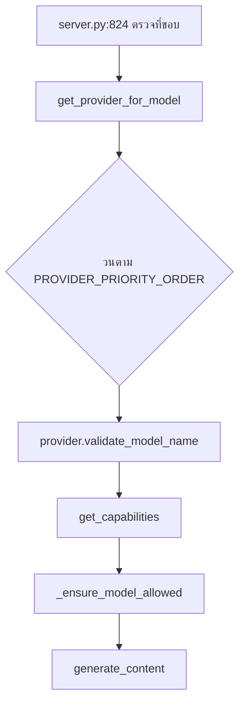

# Providers Overview and Integration

ชั้น `providers/` แปลงชื่อโมเดลเป็นปลายทางแล้วยิง HTTP — 26 โมดูล 4,586 บรรทัด · capability ของแต่ละโมเดลประกาศไว้ใน `conf/*_models.json` **ไม่ใช่ในโค้ด**

*เขียนเมื่อ 2026-08-13 ที่ `2aa6e49`*

## 1. เส้นทางการแปลงชื่อโมเดล

**`get_provider_for_model` วน `PROVIDER_PRIORITY_ORDER` ซึ่งเป็นลิสต์ที่เขียนตายไว้** — provider ที่ลงทะเบียนแล้วแต่ไม่อยู่ในลิสต์นั้น **มองไม่เห็นโดยสิ้นเชิงในการแปลงชื่อโมเดล** ขณะที่ `listmodels` ยังลิสต์มันอย่างร่าเริง

## 2. จุดเสียบ — เพิ่ม provider ใหม่

| # | ไฟล์ | เขียนอะไร |
|---|---|---|
| 1 | `providers/shared/provider_type.py:11-18` | สมาชิกใหม่ของ enum `ProviderType` |
| 2 | `conf/<name>_models.json` (ใหม่) | capability manifest |
| 3 | `providers/registries/<name>.py` (ใหม่) | subclass ของ `CapabilityModelRegistry` ราว 15 บรรทัด |
| 4 | `providers/registries/__init__.py:4-19` | import + `__all__` |
| 5 | `providers/<name>.py` (ใหม่) | คลาส provider |
| 6 | `providers/__init__.py:3-21` | import + `__all__` |
| 7 | `providers/registry.py:38-46` | **เพิ่มลง `PROVIDER_PRIORITY_ORDER`** |
| 8 | `providers/registry.py:334-342` | ชื่อ env var ใน `key_mapping` |
| 9 | `server.py:378-536` | การตรวจ key แล้ว `register_provider(...)` ในบล็อกที่เรียงตามลำดับความสำคัญ |
| 10 | `utils/model_restrictions.py:50-56` | `ProviderType.X: "X_ALLOWED_MODELS"` ใน `ENV_VARS` |
| 11 | `tools/listmodels.py:100-106` | เพื่อให้ provider โผล่ใน `listmodels` |
| 12 | `pyproject.toml:34-42` | เพิ่ม manifest ลง `[tool.setuptools.data-files]` |

## 3. สิ่งที่ได้ฟรีถ้า backend พูด OpenAI wire protocol

subclass `RegistryBackedProviderMixin, OpenAICompatibleProvider` แล้วได้ — การสร้าง client และการตรวจ base URL · retry · `generate_content` รวมทั้งกิ่ง `/responses` สำหรับ reasoning model · `count_tokens` · การจัดการรูป · และ `MODEL_CAPABILITIES` ที่ถูกเติมจาก JSON ตอน import

**ยังต้องเขียนเอง** — `REGISTRY_CLASS` · `base_url` เริ่มต้น · `get_provider_type` · และ `get_preferred_model(category, allowed_models)` ซึ่งเป็นตัวที่ auto mode เรียก · `providers/xai.py:44-82` เป็นตัวอ้างอิงที่สั้นที่สุด · backend ที่ไม่ใช่ทรง OpenAI ให้ดู `providers/gemini.py` แล้วเขียน `generate_content` เอง

**`ModelProvider` มี abstract แค่สองตัว** — `get_provider_type` กับ `generate_content` · ที่เหลือมีค่าเริ่มต้นหมด รวมทั้ง `count_tokens` ที่ตกกลับไปใช้ `len(text) // 4`

## 4. กับดัก — ข้อ 7 และข้อ 10 เงียบเมื่อลืม

`register_provider` เขียนลง `instance._providers` และ `get_available_models` วน **dict นั้น** โมเดลของคุณจึงโผล่ใน `listmodels` · แต่ `get_provider_for_model` ซึ่งเป็นฟังก์ชันที่ `server.py:823` ใช้ตัดสินว่าคำขอนี้เสิร์ฟได้ไหม วน **`PROVIDER_PRIORITY_ORDER`** และดูเฉพาะสมาชิกที่อยู่ในลิสต์

**ผลคือทุก call ไปตายที่ `server.py:826-841` ด้วยข้อความว่า *"Model 'x' is not available with current API keys"* ขณะที่ `listmodels` บอกว่ามันมี**

**และการลืมแบบนี้เกิดขึ้นจริงแล้วใน tree** — `utils/model_restrictions.py:51-56` map แค่ห้าตัว · `ProviderType.AZURE` กับ `CUSTOM` มีอยู่ใน enum และถูก register ที่ `server.py:509` และ `:529` แต่ไม่มี `*_ALLOWED_MODELS` **นโยบายข้อจำกัดจึงไม่มีผลกับสองตัวนั้นเงียบๆ**

## 5. capability manifest

`conf/xai_models.json` เป็นตัวอย่างที่สมบูรณ์ที่เล็กที่สุด — บล็อก `_README` แล้วตามด้วย array `models` ที่ field ตรงกับ `ModelCapabilities`

**`providers/shared/model_capabilities.py` คือผู้มีอำนาจว่า manifest ใส่อะไรได้** เพราะ `registries/base.py:21` derive ชุด key ที่ยอมรับจาก `dataclasses.fields(ModelCapabilities)`

ลำดับการหาไฟล์ — argument `config_path` → env `<NAME>_MODELS_CONFIG_PATH` → package `conf` ผ่าน `importlib.resources` → filesystem

**`intelligence_score` ถูกบันทึกว่าเป็นสัญญาณหลักของการเรียงลำดับใน auto mode** แต่ `get_effective_capability_rank` ถูกตัดที่ 100 และโมเดลระดับแนวหน้าคำนวณได้เกิน — ที่ปลายบนของช่วง มันจึงไม่มีผลอะไรเลย

## 6. พฤติกรรมที่ต้องรู้ก่อนพึ่งพาชั้นนี้

**allowlist เปลี่ยนเส้นทาง ไม่ได้ปฏิเสธ** · พิสูจน์ด้วยการรัน — ตั้ง `OPENAI_ALLOWED_MODELS=gpt-5.2` แล้วชื่อ `o3` ถูกเสิร์ฟโดย **DIAL** เป็น `o3-2025-04-16` · ผู้ดูแลที่ตั้ง allowlist ด้วยเหตุผลเรื่องราคาหรือ compliance จะได้ vendor คนละเจ้า สัญญาประมวลผลข้อมูลคนละฉบับ และบิลคนละใบ แทนที่จะได้การปฏิเสธ

**auto mode เป็นการเรียงตามตัวอักษรสำหรับสี่ใน provider เจ็ดตัว** — `get_preferred_model()` มีเฉพาะ Gemini, OpenAI, X.AI · ที่เหลือตกไปที่ `sorted(allowed_models)[0]`

**usage อ่านได้ศูนย์บนโมเดลที่แพงที่สุด** — เส้นทาง `/responses` อ่าน `prompt_tokens`/`completion_tokens` ซึ่งไม่มีอยู่บน usage object ของ Responses API

**การสร้าง client ที่ล้มเหลวถูกลดเกรดแล้วแคชไว้** — ถ้าสร้าง httpx client ไม่ผ่าน จะตกไปใช้ `OpenAI(api_key, base_url)` เปล่าๆ ทิ้ง timeout config, `DEFAULT_HEADERS` และ organization แล้วแคชตัวที่ลดเกรดไว้ตลอดอายุ process · สำหรับ DIAL นั่นคือการทิ้ง header ยืนยันตัวตนตัวเดียวที่มี

**`CUSTOM_*_TIMEOUT` มีผลกับทุก provider** ไม่ใช่แค่ custom endpoint — ค่าที่ตั้งไว้สำหรับ Ollama ในเครื่องไปตั้งค่าใหม่ให้ OpenAI, Azure, X.AI, DIAL และ OpenRouter ด้วย
