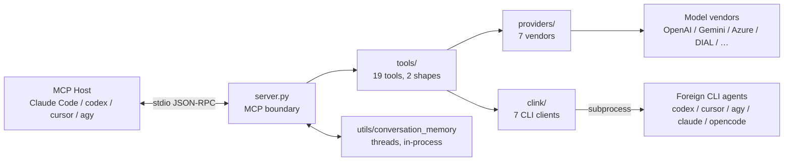

# PAL MCP System Architecture Overview

เอกสารนี้สรุปสถาปัตยกรรมของ PAL MCP fork ในระดับ high-level เพื่อให้ agent หรือวิศวกรที่กำลังจะแก้อะไรสักอย่าง **มองเห็นรัศมีผลกระทบก่อนลงมือ** แทนที่จะเดาจากไฟล์ที่บังเอิญได้อ่าน

> [!important] อ่านคู่กับ [GENERATED_STRUCTURE.md](GENERATED_STRUCTURE.md) เสมอ
> ไฟล์นั้นถูกสร้างจากโค้ดจริงด้วย `scripts/blueprint.py` — กราฟ import, ชั้นของระบบ, ขนาดโมดูล, และโมดูลที่ไม่มีเทสต์เอ่ยถึง **ตัวเลขทุกตัวในเอกสารนี้มาจากไฟล์นั้น** ถ้าสองไฟล์ขัดกัน ให้เชื่อไฟล์ที่ถูกสร้าง แล้วรัน `python scripts/blueprint.py` ใหม่

## 1. High-Level Architecture



**สิ่งที่ต้องเข้าใจก่อนอย่างอื่น** — PAL ไม่ได้เป็นแค่ proxy ไปหาโมเดล · ครึ่งหนึ่งของมันคือชั้น `clink` ที่ **spawn coding agent ของค่ายอื่นเป็น subprocess** ซึ่งเป็นสิ่งที่ทำให้ fork นี้ต่างจาก upstream และเป็นที่มาของข้อจำกัดเรื่องความปลอดภัยเกือบทั้งหมด

## 2. Core Components

### 2.1 The MCP boundary (`server.py`, 1,526 บรรทัด)

จุดเข้าเดียวของระบบ · รับ `handle_call_tool` แล้วทำสามอย่างตามลำดับ — ประกอบ thread ขึ้นใหม่ถ้ามี `continuation_id` · เลือก tool จาก `TOOLS` dict · แล้วเรียก `tool.execute()`

**ทางลัดที่ต้องรู้:** tool ที่ `requires_model()` เป็น `False` จะ **return ออกก่อน** ถึงชั้นสร้าง model context และก่อนการตรวจขนาดไฟล์ที่ MCP boundary · เก้าจาก 18 tool อยู่ในกลุ่มนี้ รวมทั้ง `clink` และ `consensus`

### 2.2 The tool layer (`tools/`, 15,740 บรรทัด — ครึ่งหนึ่งของทั้งระบบ)

มีสองทรง และการเลือกทรงเปลี่ยนเกือบทุกอย่าง

| ทรง | ฐาน | พฤติกรรม | ตัวอย่าง |
|---|---|---|---|
| **Simple** | `tools/simple/base.py` (1,011) | เรียกครั้งเดียว ตอบครั้งเดียว | `chat`, `clink`, `challenge`, `apilookup` |
| **Workflow** | `tools/workflow/workflow_mixin.py` (1,608) + `base.py` (449) | หลายขั้น บังคับให้ผู้เรียกหยุดทำงานระหว่างขั้น | `debug`, `codereview`, `analyze`, `planner`, `consensus` |

**tool ทุกตัวเป็น singleton ระดับโมดูล** สร้างครั้งเดียวตอน import แล้วใช้ซ้ำทุก request — คอมเมนต์ที่ `server.py:260` เขียนว่า *"stateless design"* ซึ่งไม่จริง ดู [Memory](Memory/MEMORY_OVERVIEW_AND_INTEGRATION.md)

### 2.3 The clink layer (`clink/`, 2,407 บรรทัด)

รับ prompt แล้ว spawn CLI ของค่ายอื่นเป็น subprocess · โครงเป็นสามชิ้นที่แยกกันชัด

```text
conf/cli_clients/*.json   นิยาม client (คำสั่ง, args, role, rate card)
clink/agents/*.py         ตัวสร้างคำสั่งและตัวรัน  — ต่อ client ที่ต้องการพฤติกรรมพิเศษ
clink/parsers/*.py        แปลง stdout เป็น ParsedCLIResponse — ต่อรูปแบบ output
```

**client ใหม่ส่วนใหญ่ไม่ต้องเขียนโค้ด** — ไฟล์ config บวก entry ใน `clink/constants.py` ก็พอ ถ้ารูปแบบ output ตรงกับ parser ที่มีอยู่

### 2.4 The provider layer (`providers/`, 4,586 บรรทัด)

แปลงชื่อโมเดลเป็น provider แล้วยิง HTTP · `OpenAICompatibleProvider` เป็นฐานที่ vendor ส่วนใหญ่สืบทอด · capability ของแต่ละโมเดลประกาศไว้ใน `conf/*_models.json` ไม่ใช่ในโค้ด

### 2.5 The memory layer (`utils/conversation_memory.py`, 1,108 บรรทัด)

เก็บ thread ของบทสนทนาไว้ใน **dict ของ process เท่านั้น** — ไม่มี Redis ไม่มี disk ไม่มีฐานข้อมูล · และเพราะ transport เป็น stdio ตัว server จึงเป็น subprocess ของ host **thread ทั้งหมดตายพร้อม session ของ client**

### 2.6 The prompt layer (`systemprompts/`, 2,370 บรรทัด)

ข้อความที่ส่งถึงโมเดลทุกครั้ง · **ประมาณหนึ่งในสี่ของชั้นนี้ไปไม่ถึงโมเดลเลย** เพราะ tool ที่เป็นเจ้าของปิด expert analysis ไว้ ดู [Tools](Tools/TOOLS_OVERVIEW_AND_INTEGRATION.md)

## 3. Layers by size and dependency

ตัวเลขจาก [GENERATED_STRUCTURE.md](GENERATED_STRUCTURE.md) · **111 โมดูล 31,021 บรรทัด**

| Layer | Modules | Lines | imports ออก | โมดูลที่พึ่งพา |
|---|---:|---:|---:|---:|
| `entry` | 2 | 1,683 | 23 | 26 |
| `tools` | 31 | 15,740 | 175 | 113 |
| `clink` | 22 | 2,407 | 35 | 37 |
| `providers` | 26 | 4,586 | 88 | 96 |
| `prompts` | 15 | 2,370 | 14 | 27 |
| `utils` | 12 | 3,560 | 23 | 60 |

## 4. Responsibility by Layer

* **`server.py`** — ขอบเขต MCP, การประกอบ thread, การเลือก tool, การตัดสินว่าคำขอนี้ต้องใช้โมเดลไหม
* **`tools/`** — business logic ทั้งหมด และ **สัญญาที่ประกาศต่อ host** ผ่าน JSON Schema
* **`clink/`** — การมอบงานให้ agent ของค่ายอื่น: สร้างคำสั่ง, spawn, แปลผล
* **`providers/`** — การแปลงชื่อโมเดลเป็นปลายทาง และการเรียก vendor
* **`utils/`** — thread ของบทสนทนา, การอ่านไฟล์, งบ token, ข้อจำกัดของโมเดล
* **`systemprompts/`** — ข้อความที่กำหนดพฤติกรรมของโมเดล

## 5. Seams ที่ไม่ได้อยู่ตรงที่มันดูเหมือนจะอยู่

ส่วนนี้คือเหตุผลที่พิมพ์เขียวนี้มีอยู่ · ทั้งหมดวัดจาก [GENERATED_STRUCTURE.md](GENERATED_STRUCTURE.md)

**มี 14 เส้นที่ชั้นล่าง import ชั้นบน** ซึ่งกลับด้านกับสิ่งที่การแบ่งชั้นสัญญาไว้ · เส้นที่สำคัญที่สุดห้าเส้นคือ `providers.{base,gemini,openai,registry,xai}` → `tools.models` — **ชั้น provider พึ่งพา response model ของชั้น tool** · และ `utils.conversation_memory` → ทั้ง `server` และ `providers.registry` ซึ่งข้ามขึ้นไปสองชั้น

**โมดูลที่ถูกพึ่งพามากที่สุดคือ `tools.models` (27 ตัว) และมันตายไป 86%** — 26 จาก 28 ชื่อสาธารณะไม่มีโค้ดโปรดักชันอ้างถึง · ใครที่จะขยายซองคำตอบจะอ่านไฟล์นี้เป็นสัญญา แล้วต่อของใหม่เข้ากับสิ่งที่ไม่มีใครบริโภค

**`tools.workflow.schema_builders` มี 13 โมดูลพึ่งพา และไม่มีไฟล์เทสต์ไหนเอ่ยถึงเลย** · `tools.workflow.base` มี 12 ตัวพึ่งพากับเทสต์หนึ่งไฟล์ · **33 จาก 111 โมดูลไม่มีเทสต์เอ่ยถึง**

## 6. อะไรเชื่อได้ อะไรต้องตรวจเอง

เอกสารชุดนี้แบ่งเป็นสองครึ่งโดยตั้งใจ

* **ครึ่งที่ถูกสร้าง** — [GENERATED_STRUCTURE.md](GENERATED_STRUCTURE.md) · สร้างใหม่ได้ทุก checkpoint ด้วยคำสั่งเดียว จึงไม่เน่า
* **ครึ่งที่เขียนมือ** — เอกสารรายส่วนใน `Server/` `Tools/` `Clink/` `Providers/` `Memory/` · แบกวิจารณญาณ จึงเน่าได้ และมีวันที่กำกับไว้เสมอ

ข้อบกพร่องที่พบระหว่างทำพิมพ์เขียวนี้ **ไม่ได้อยู่ในเอกสารชุดนี้** — มันอยู่ใน [`docs/reports/2026-08-13-deep-scan-architecture-safety-and-direction.md`](../docs/reports/2026-08-13-deep-scan-architecture-safety-and-direction.md) · พิมพ์เขียวตอบว่า *ระบบประกอบขึ้นมายังไง* รายงานตอบว่า *อะไรพัง* และการปนกันทำให้ทั้งสองอ่านยากขึ้น
