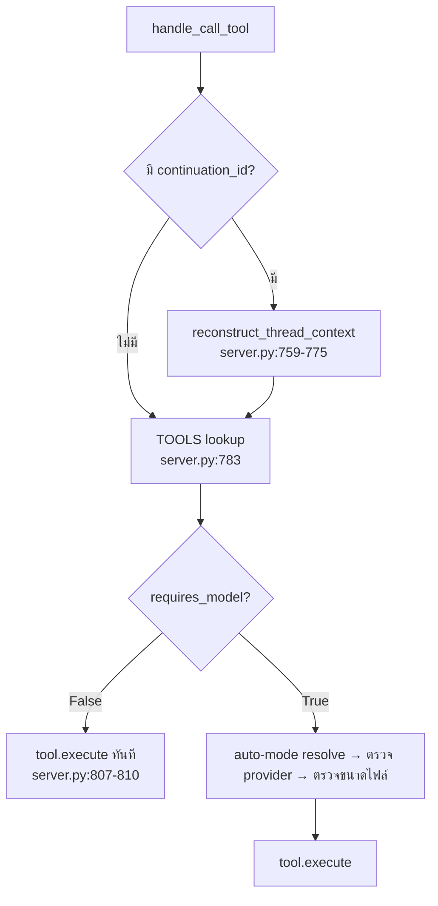

# Server Overview and Integration

`server.py` (1,526 บรรทัด) คือขอบเขต MCP และเป็นจุดเข้าเดียวของระบบ · หน้านี้ไล่วงจรชีวิตของคำขอทั้งสามแบบ และที่สำคัญกว่าคือ **รายการทางลัดที่ข้ามขั้นตอน** ซึ่งเป็นจุดที่แบบจำลองในหัวของผู้แก้โค้ดพัง

*เขียนเมื่อ 2026-08-13 ที่ `2aa6e49`*

## 1. บทนำร่วม — เหมือนกันทั้งสามแบบ

**`reconstruct_thread_context` รันก่อนการ dispatch** จึงรันกับ tool ทุกตัวรวมทั้งตัวที่ไม่ใช้โมเดล · ผลคือ tool ที่พึ่งพาตัวเองได้ทั้งแปดตัว (`planner` `tracer` `docgen` `consensus` `challenge` `apilookup` `listmodels` `version`) **ล้มด้วย `ValueError` ทุกครั้งที่มี `continuation_id` ถ้าไม่มี provider ตั้งค่าไว้** — โปรโตคอลหลายขั้นที่พวกมันมีไว้ใช้จึงเอื้อมไม่ถึงในสภาพนั้น

## 2. สามวงจรชีวิต โดยย่อ

**Simple tool** (`chat`) — `execute` → เตรียม prompt → เรียกโมเดล → `_parse_response` → บันทึก turn → เสนอ continuation

**Workflow tool** (`debug`) ขั้นที่ 1 แล้วต่อขั้นที่ 2 — ขั้นที่สองกู้สี่อย่างคืนมา

| กู้อะไร | จากไหน | ที่ไหน |
|---|---|---|
| `work_history` | `model_metadata` ของ assistant turn ล่าสุด **ของ tool ตัวเดียวกัน** | `workflow_mixin.py:679-683` |
| `initial_request` | turn เดียวกัน | `:684` |
| `consolidated_findings` | คำนวณใหม่จาก `work_history` | `:686`, `:1391` |
| ฟิลด์ที่ผู้เรียกไม่ส่งมา | `context.initial_context` ของขั้นที่ 1 | `server.py:1263-1268` |

**การกู้ทำงานเฉพาะเมื่อ thread มี assistant turn ของ tool ตัวเดียวกันที่พก `work_history`** · ถ้าไม่มี run จะเดินต่อบนสถานะ singleton ที่ค้างอยู่แล้ว **เขียนมันลง thread ใหม่** ซึ่งเปลี่ยนการรั่วในหน่วยความจำให้กลายเป็นการปนเปื้อนถาวร

**clink delegation** — ดู [Clink](../Clink/CLINK_OVERVIEW_AND_INTEGRATION.md) หัวข้อ 2

## 3. รายการทางลัด — จุดที่ขั้นตอนถูกข้าม

| เงื่อนไข | ที่ไหน | ข้ามอะไร |
|---|---|---|
| `requires_model()` เป็น `False` | `server.py:807-810` | การแปลง auto mode · การตรวจ provider · การกันขนาดไฟล์ที่ขอบ |
| `next_step_required=True` | `workflow_mixin.py:499-509` | การอ่านไฟล์ทั้งหมด เก็บแค่ basename |
| `next_step_required=True` | `workflow_mixin.py:720-724` | กิ่ง expert analysis ทั้งกิ่ง ไม่มีการเรียก provider |
| exception ใดๆ ใน `_add_workflow_metadata` | `workflow_mixin.py:1195-1199` | `model_used` / `provider_used` หายจากคำตอบ |
| การเขียน code artifact ล้มเหลว | `tools/chat.py:251-263` | artifact หาย · คำเตือนถูกพับเข้าไปในเนื้อคำตอบ **และ call ยังรายงานว่าสำเร็จ** |
| ออกด้วย exit code 0 แต่ไม่มีคำตอบ | `clink/agents/base.py:397-401` | เส้นทางสำเร็จ · run ถูกแปลงเป็น error ที่เนื้อหาเป็น diagnostics ของ CLI |
| output เกิน 20,000 ตัวอักษร **และ** มี `
` | `tools/clink.py:626-651` | **คำตอบจริงทั้งหมด** เหลือแค่ summary |

## 4. ประตูสามบานที่ไม่ได้ครอบทุก tool

**นี่คือหัวข้อที่ต้องอ่านก่อนแก้ประตูบานไหนก็ตาม**

| ประตู | ครอบ | **ไม่ครอบ** | ที่ไหน |
|---|---|---|---|
| การตรวจขนาดไฟล์ตั้งแต่ต้น | tool ที่ใช้ฟิลด์ `absolute_file_paths` (มีสองตัว) | **ทุก workflow tool** ซึ่งใช้ `relevant_files` | `server.py:856` |
| การตรวจว่าโมเดลใช้ได้ที่ขอบ MCP | `requires_model() == True` | เก้า tool | `server.py:807`, `:823` |
| เพดาน `MAX_RESPONSE_CHARS` | เส้นทางสำเร็จของ clink | tool อื่นทุกตัว และเส้นทาง error ของ clink เอง | `tools/clink.py:343` |

## 5. สิ่งที่ต้องรู้ก่อนเพิ่มการตรวจใหม่

การตรวจที่เพิ่มที่ `server.py` **ก่อน** บรรทัด 807 จะครอบทุก tool · การตรวจที่เพิ่ม **หลัง** บรรทัดนั้นจะครอบเฉพาะ tool ที่ใช้โมเดล ซึ่งเป็นเก้าในสิบแปด · และการตรวจที่อ่าน `arguments["absolute_file_paths"]` จะครอบสอง tool

**ประวัติศาสตร์ของ repo นี้บอกว่าการตรวจถูกเพิ่มที่จุดเรียกเดียวเสมอ** — ดู [INVARIANTS.md](../INVARIANTS.md) · ถ้าคุณกำลังเพิ่มการตรวจ ให้ระบุไว้ในโค้ดตรงๆ ว่ามันครอบอะไรไม่ครอบอะไร ไม่งั้นคนอ่านคนต่อไปจะสมมติว่าครอบหมด
